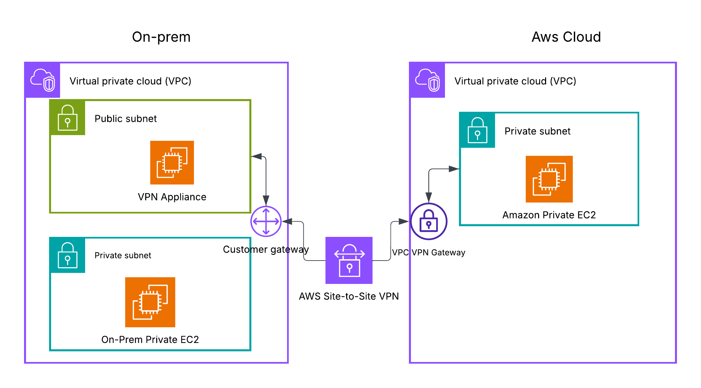

# Perfect AWS Site-to-Site VPN — Complete Lab from Scratch
### 📖 Comprehensive Learning Guide, Deep-Dive Technical Explanations, & Excalidraw Architecture

This document is designed to act as your complete learning companion and architectural blueprint. It details the step-by-step implementation of mimicking an On-Premises to AWS Cloud Site-to-Site VPN using two separate AWS VPCs, with a software-based **StrongSwan** EC2 instance acting as the virtual on-premises router and an AWS **Virtual Private Gateway (VGW)** acting as the cloud-side VPN concentrator.

---

## 🏗️ 1. Architecture We Are Building

The following diagram illustrates the network layout, subnets, and routing paths established in this lab.


---

---

## 📘 2. Step-by-Step Lab Execution with Deep-Dive Explanations

Each step below includes the action to perform, followed by the **What**, **Why**, **Consequences**, and **Technical Mechanics** to fully explain the core engineering principles.

---

### PART 1 — CREATE ON-PREM VPC

#### Step 1 — Create VPC
```
AWS Console → VPC → Your VPCs → Create VPC
```
| Field | Value |
|:---|:---|
| **Name tag** | OnPrem-VPC |
| **IPv4 CIDR** | 10.10.0.0/16 |
| **Tenancy** | Default |

> [!NOTE]
> **🔍 What is Happening:** We are establishing a logically isolated virtual network named `OnPrem-VPC` within our AWS region, defining a massive block of 65,536 private IP addresses (`10.10.0.0` to `10.10.255.255`).
> 
> **💡 Why it is Happening:** To test a Site-to-Site VPN, we need two separate, completely isolated environments. Because we don't have a physical on-premises data center, we use this VPC to simulate our corporate "On-Premises" network.
> 
> **⚡ If you do this (Consequences):** AWS carves out a software-defined routing domain. No servers inside it can talk to the internet, and no internet traffic can reach it. It exists as a silent private island in the cloud.
> 
> **🧠 Deep Tech Explanation (CIDR Overlap):** 
> Classless Inter-Domain Routing (CIDR) blocks must be carefully planned. To connect two networks (like On-Prem and AWS Cloud), **their CIDR blocks must never overlap**. If they did (e.g., both used `10.10.0.0/16`), a packet sent to `10.10.2.5` would be processed locally because the operating system/virtual router would think the destination is on the same local subnet. Overlapping blocks make standard IPsec routing impossible without complex NAT overlays.

---

#### Step 2 — Create Internet Gateway for OnPrem VPC
```
VPC → Internet Gateways → Create Internet Gateway
Name: OnPrem-IGW
→ Create → Actions → Attach to VPC → Select OnPrem-VPC → Attach
```

> [!NOTE]
> **🔍 What is Happening:** We are deploying a virtual edge router component called an Internet Gateway (IGW) and binding it to our OnPrem VPC.
> 
> **💡 Why it is Happening:** In order to establish a VPN tunnel, the VPN gateway appliance inside our On-Premises network must be able to initiate an internet-based hand-shake with the AWS-side VPN gateway. It needs direct, raw access to send and receive public internet traffic.
> 
> **⚡ If you do this (Consequences):** The VPC is now physically connected to the edge of AWS's regional public network. However, no traffic will flow through it yet because we haven't told our subnets' route tables to use it.
> 
> **🧠 Deep Tech Explanation (IGW Architecture):**
> Unlike a standard physical hardware router, an AWS Internet Gateway is a horizontally scaled, redundant, and highly available logical software component. It does not introduce a bandwidth bottleneck or single point of failure. It performs **Network Address Translation (1:1 NAT)** on the fly, translating an instance's private IP to its public Elastic IP when packets cross the IGW boundary.

---

#### Step 3 & 4 — Create Public and Private Subnets in OnPrem VPC
```
VPC → Subnets → Create Subnet
```
| Subnet | Name | Availability Zone | IPv4 CIDR |
|:---|:---|:---|:---|
| **Subnet 1** | OnPrem-Public-Subnet | Select one (e.g. ap-south-1a) | 10.10.1.0/24 |
| **Subnet 2** | OnPrem-Private-Subnet | Same as above | 10.10.2.0/24 |

> [!NOTE]
> **🔍 What is Happening:** We are subdividing our massive `10.10.0.0/16` network block into two smaller logical segments (`10.10.1.x` and `10.10.2.x`), each containing 256 addresses.
> 
> **💡 Why it is Happening:** We must enforce security isolation. The VPN gateway instance (which needs internet exposure) will reside in the **Public** subnet. Our test database/application server (representing sensitive on-prem systems) must be protected, so it is hidden in the **Private** subnet.
> 
> **⚡ If you do this (Consequences):** We create distinct L2-like broadcast domains within our VPC. Instances in different subnets cannot communicate unless routed.
> 
> **🧠 Deep Tech Explanation (AWS Reserved IPs):**
> In a standard `/24` subnet, there are 256 IP addresses. However, AWS reserves **5 IP addresses** in every subnet for administrative infrastructure:
> - `10.10.1.0`: Network Address.
> - `10.10.1.1`: VPC Router (provides basic L3 gateway routing within the VPC).
> - `10.10.1.2`: DNS Server (AWS Route 53 Resolver).
> - `10.10.1.3`: Reserved for future AWS features.
> - `10.10.1.255`: Broadcast Address (not supported in AWS VPCs, but reserved).
> Thus, only 251 addresses are usable.

---

#### Step 5 — Create Public Route Table for OnPrem
```
VPC → Route Tables → Create Route Table
Name: OnPrem-Public-RT | VPC: OnPrem-VPC
→ Select OnPrem-Public-RT → Routes tab → Edit Routes → Add Route
Destination: 0.0.0.0/0  |  Target: Internet Gateway → OnPrem-IGW → Save
→ Subnet Associations tab → Edit Subnet Associations → Check OnPrem-Public-Subnet → Save
```

> [!NOTE]
> **🔍 What is Happening:** We are creating a routing directory, adding a default route pointing to our Internet Gateway, and associating it exclusively with the `OnPrem-Public-Subnet`.
> 
> **💡 Why it is Happening:** In AWS, **a subnet is defined as "Public" solely by the fact that its route table has a default route (`0.0.0.0/0`) targeting an Internet Gateway.** Without this, any public IP assigned to an instance in this subnet is useless, as packets wouldn't know how to reach the internet.
> 
> **⚡ If you do this (Consequences):** The `OnPrem-Public-Subnet` is now fully operational and live on the internet. Any instance launched here that is assigned a public IP can now pull updates and establish connections.
> 
> **🧠 Deep Tech Explanation (Longest Prefix Matching):**
> When routing packets, the router uses **Longest Prefix Matching**. If an instance in the subnet sends a packet to `10.10.2.5`, the router evaluates the route table:
> - Route 1: `10.10.0.0/16` -> Local (Prefix length /16)
> - Route 2: `0.0.0.0/0` -> IGW (Prefix length /0)
> Since `/16` is a longer, more specific match than `/0`, the packet is successfully routed locally to the private subnet instead of being thrown to the Internet Gateway.

---

#### Step 6 — Create Private Route Table for OnPrem
```
VPC → Route Tables → Create Route Table
Name: OnPrem-Private-RT | VPC: OnPrem-VPC
→ Select OnPrem-Private-RT → Subnet Associations tab → Edit Subnet Associations → Check OnPrem-Private-Subnet → Save
(Do NOT add a route to the IGW)
```

> [!NOTE]
> **🔍 What is Happening:** We are creating a separate route table containing only the local route (`10.10.0.0/16 -> Local`) and binding it to our Private Subnet.
> 
> **💡 Why it is Happening:** We want to guarantee that our private instances are physically incapable of communicating with the internet directly. This prevents malicious scans or unintended data exfiltration.
> 
> **⚡ If you do this (Consequences):** Any instance in the `OnPrem-Private-Subnet` is locked down. It can talk to the public subnet locally, but cannot access any external internet resources.

---

### PART 2 — CREATE AWS CLOUD VPC

#### Steps 7, 8, & 9 — Create AWS Cloud VPC, Subnet, & Route Table
```
Create AWS-Cloud-VPC  | CIDR: 10.20.0.0/16
Create AWS-Private-Subnet (ap-south-1a or any AZ) | CIDR: 10.20.1.0/24
Create AWS-Cloud-Private-RT | Associate with AWS-Private-Subnet
(Do NOT add routes yet)
```

> [!NOTE]
> **🔍 What is Happening:** We are establishing the "AWS Cloud" side of our architecture using a distinct, non-overlapping private address range of `10.20.0.0/16`.
> 
> **💡 Why it is Happening:** This mimics a standard production cloud environment containing sensitive applications. It has **no Internet Gateway**. Our goal is to connect this isolated private network to our simulated "On-Premises" VPC securely over the internet via an IPsec VPN tunnel, keeping it hidden from the public eye.
> 
> **⚡ If you do this (Consequences):** You have successfully constructed two isolated virtual islands (`10.10.x.x` and `10.20.x.x`). They are currently completely unaware of each other's existence.

---

### PART 3 — LAUNCH EC2 INSTANCES

#### Step 10 — Launch VPN Appliance EC2
```
EC2 → Launch Instance
Name: VPN-Appliance | AMI: Ubuntu Server 22.04 LTS | Type: t2.micro
VPC: OnPrem-VPC | Subnet: OnPrem-Public-Subnet | Auto-assign Public IP: DISABLE
```
**Security Group: `VPN-Appliance-SG` Inbound Rules:**
* **SSH (TCP 22):** Source `0.0.0.0/0` (Allows administrative access)
* **All ICMP-v4 (ICMP All):** Source `0.0.0.0/0` (Allows network diagnostic pings)
* **Custom UDP 500:** Source `0.0.0.0/0` (**ISAKMP/IKE Negotiation**)
* **Custom UDP 4500:** Source `0.0.0.0/0` (**IPsec NAT-Traversal**)
* **All Traffic (All protocols/ports):** Source `0.0.0.0/0` (Ensures unrestricted internal packet routing)

> [!NOTE]
> **🔍 What is Happening:** We are deploying a virtual machine in the public subnet of our On-Prem VPC to act as our software-defined VPN router, and opening specific firewall ports.
> 
> **💡 Why it is Happening:** Traditional network environments use dedicated hardware (like Cisco ASA or Juniper). Here, we run **StrongSwan** (an open-source Linux IPsec implementation) on an Ubuntu instance. We open ports 500 and 4500 because they are the industry-standard cryptographic ports required for IPsec VPN negotiation.
> 
> **⚡ If you do this (Consequences):** A virtual server is provisioned. It sits at the edge of the OnPrem network, waiting for software configuration.
> 
> **🧠 Deep Tech Explanation (UDP 500 vs. UDP 4500):**
> - **UDP Port 500 (ISAKMP/IKE):** Used during the initial handshake to negotiate cryptographic algorithms, exchange keys, and authenticate the two ends of the tunnel.
> - **UDP Port 4500 (NAT-Traversal / NAT-T):** Traditional IPsec traffic uses IP protocol 50 (ESP - Encapsulating Security Payload). ESP packets do not have UDP/TCP port numbers. If your router is behind a standard NAT device, the NAT cannot rewrite the port numbers of ESP traffic, causing the packet to be dropped. Wrapping (encapsulating) the ESP packets in standard UDP Port 4500 allows them to pass through NAT/PAT systems effortlessly.

---

#### Step 11 — Assign Elastic IP to VPN Appliance
```
EC2 → Elastic IPs → Allocate Elastic IP Address → Allocate
Select EIP → Actions → Associate Elastic IP Address → Instance: VPN-Appliance → Associate
```

> [!NOTE]
> **🔍 What is Happening:** We are allocating a static, public IPv4 address from AWS's pool and binding it permanently to our VPN appliance instance.
> 
> **💡 Why it is Happening:** The AWS Site-to-Site VPN service needs a single, static public IP address to target. Standard AWS public IPs are dynamic and change if the instance is stopped and restarted. An Elastic IP ensures the connection remains stable.
> 
> **⚡ If you do this (Consequences):** The VPN appliance gains a fixed public identity on the internet.

---

#### Step 12 — Disable Source/Destination Check on VPN Appliance
```
EC2 → Instances → Select VPN-Appliance → Actions → Networking → Change Source/Destination Check → UNCHECK "Enable" → Save
```

> [!IMPORTANT]
> **🔍 What is Happening:** We are removing AWS's default network filter from the VPN Appliance's virtual network interface (ENI).
> 
> **💡 Why it is Happening:** By default, AWS security dictates that an EC2 instance can only send or receive network packets if the packet's source or destination IP matches the instance's own private IP. Because this appliance is acting as a **router**, it will be receiving packets destined for the AWS Cloud range (`10.20.1.x`) and sending packets on behalf of the private OnPrem instance (`10.10.2.x`). 
> 
> **⚡ If you do this (Consequences):** The hypervisor/Nitro system allows transit routing. If you skip this step, AWS will drop the packets at the virtualization layer, and your VPN tunnel will appear active, but **no data will ever pass through it.**

---

#### Steps 13 & 14 — Launch OnPrem Private and AWS Private EC2 Instances
```
OnPrem Private EC2: Launch in OnPrem-VPC | OnPrem-Private-Subnet | SG: Allow SSH, ICMP
AWS Private EC2: Launch in AWS-Cloud-VPC | AWS-Private-Subnet | SG: Allow ICMP & All from 10.10.0.0/16
```

> [!NOTE]
> **🔍 What is Happening:** We are launching two test machines inside the private subnets of both VPCs.
> 
> **💡 Why it is Happening:** These machines act as our end-hosts. They have no public IPs and cannot talk to the internet. We will use them to prove that they can communicate with each other over the secure VPN tunnel using exclusively their private IP addresses.

---

### PART 4 — CREATE VPN COMPONENTS

#### Step 15 — Create Virtual Private Gateway (VGW)
```
VPC → Virtual Private Gateways → Create Virtual Private Gateway
Name: AWS-VGW | ASN: Amazon default ASN
→ Actions → Attach to VPC → AWS-Cloud-VPC → Attach (Wait for "Attached")
```

> [!NOTE]
> **🔍 What is Happening:** We are provisioning a managed virtual VPN concentrator on the AWS Cloud VPC side.
> 
> **💡 Why it is Happening:** The AWS Cloud VPC needs a gateway that natively understands IPsec and can encrypt/decrypt traffic entering and leaving the AWS cloud environment.
> 
> **⚡ If you do this (Consequences):** A highly redundant, AWS-managed VPN endpoint is attached to the edge of the `AWS-Cloud-VPC`.
> 
> **🧠 Deep Tech Explanation (ASNs and VGW):**
> The Autonomous System Number (ASN) is used if we are configuring BGP (Border Gateway Protocol) for dynamic routing. We use the Amazon default ASN (typically 64512 in the private range) because this lab utilizes static routing, meaning we will hardcode the routing paths instead of letting BGP negotiate them dynamically.

---

#### Step 16 — Create Customer Gateway (CGW)
```
VPC → Customer Gateways → Create Customer Gateway
Name: OnPrem-CGW | Routing: Static | IP Address: YOUR ELASTIC IP (from Step 11)
```

> [!NOTE]
> **🔍 What is Happening:** We are registering our StrongSwan instance's Elastic IP address in the AWS console, creating a logical pointer called a Customer Gateway.
> 
> **💡 Why it is Happening:** AWS needs to know the public IP address of the on-premises device it will be establishing a VPN tunnel with.
> 
> **⚡ If you do this (Consequences):** AWS has a logical configuration mapping indicating where to send its side of the IPsec traffic.

---

#### Step 17 — Create Site-to-Site VPN Connection
```
VPC → Site-to-Site VPN Connections → Create VPN Connection
Name: OnPrem-to-AWS-VPN | Target: VGW (AWS-VGW) | Customer Gateway ID: OnPrem-CGW
Routing Options: Static | Static IP Prefixes: 10.10.0.0/16
```

> [!NOTE]
> **🔍 What is Happening:** We are joining the VGW and the CGW together to generate the formal VPN configuration. We tell the AWS side that any traffic meant for `10.10.0.0/16` must be pushed down this tunnel.
> 
> **💡 Why it is Happening:** This command instructs AWS to spin up the actual backend cryptographic components.
> 
> **⚡ If you do this (Consequences):** AWS provisions **two separate IPsec tunnels** (for high availability and failover) and assigns them unique public IPs. The status will show `Down` because our StrongSwan appliance on-prem hasn't been configured or turned on yet.

---

#### Step 18 — Download VPN Configuration
```
Select VPN Connection → Download Configuration
Vendor: Generic | Platform: Generic | Software: Vendor Agnostic
(Write down Tunnel 1 Outside IP and Pre-Shared Key)
```

> [!NOTE]
> **🔍 What is Happening:** We are downloading a text file containing the cryptographic parameters (IPsec configurations and the Pre-Shared Key) generated by AWS for our tunnel.
> 
> **💡 Why it is Happening:** To establish a secure connection, both sides must agree on the identical encryption key (PSK) and hashing algorithms.
> 
> **⚡ If you do this (Consequences):** You obtain the crucial secret key and target public IP needed to configure StrongSwan.

---

### PART 5 — UPDATE ROUTE TABLES

#### Step 19 & 20 — Update AWS Cloud Route Table
```
VPC → Route Tables → Select AWS-Cloud-Private-RT
→ Route Propagation tab → Edit Route Propagation → Check AWS-VGW -> Save
→ Routes tab → Edit Routes → Add Route: Destination: 10.10.0.0/16 -> Target: Virtual Private Gateway (AWS-VGW) → Save
```

> [!NOTE]
> **🔍 What is Happening:** We are instructing the AWS Cloud VPC's router that any packets addressed to the On-Prem range (`10.10.0.0/16`) must be sent to the `AWS-VGW`.
> 
> **💡 Why it is Happening:** Without this, when the AWS Private EC2 (`10.20.1.x`) attempts to send a reply back to the On-Prem private subnet (`10.10.2.x`), the AWS VPC router would evaluate its route table, find no path, and drop the packet.
> 
> **⚡ If you do this (Consequences):** The outbound return path from the AWS Cloud to On-Prem is now established.
> 
> **🧠 Deep Tech Explanation (Route Propagation):**
> Enabling Route Propagation tells the AWS Route Table to automatically listen to the VGW. If the VPN were dynamic (using BGP), the VGW would automatically inject routes as they are learned. Since we are using static routing, we manually add the route, but enabling propagation ensures AWS's routing architecture natively coordinates the gateway pathways.

---

#### Step 21 — Add Route to OnPrem Private Route Table
```
VPC → Route Tables → Select OnPrem-Private-RT
→ Routes tab → Edit Routes → Add Route: Destination: 10.20.0.0/16 -> Target: Instance → VPN-Appliance EC2 → Save
```

> [!NOTE]
> **🔍 What is Happening:** We are updating the route table of our private on-premises subnet, telling it that any traffic destined for the AWS Cloud network (`10.20.0.0/16`) must be forwarded to our `VPN-Appliance` EC2 instance.
> 
> **💡 Why it is Happening:** Our private instance `OnPrem-Private-EC2` has no public IP and cannot talk to the internet or AWS. It needs a local "gateway" to handle remote traffic. By pointing the route to the VPN appliance, we make the appliance act as the default router for cloud-bound traffic.
> 
> **⚡ If you do this (Consequences):** The forward path is set: `OnPrem-Private-EC2` -> `VPN-Appliance`.

---

### PART 6 — CONFIGURE STRONGSWAN ON VPN APPLIANCE

#### Steps 22 & 23 — SSH & Install StrongSwan
```bash
ssh -i your-key.pem ubuntu@YOUR-ELASTIC-IP
sudo apt update && sudo apt install strongswan strongswan-starter -y
```

> [!NOTE]
> **🔍 What is Happening:** We log into our public-facing virtual router and install the StrongSwan IPsec service.
> 
> **💡 Why it is Happening:** StrongSwan handles the cryptographic handshakes and packet encryption at the Linux OS level.
> 
> **⚡ If you do this (Consequences):** The system prepares the IPsec configuration directories (`/etc/ipsec.conf` and `/etc/ipsec.secrets`).

---

#### Step 24 — Enable IP Forwarding
```bash
echo "net.ipv4.ip_forward=1" | sudo tee /etc/sysctl.d/99-ipforward.conf
sudo sysctl -p /etc/sysctl.d/99-ipforward.conf # Apply immediately
```

> [!IMPORTANT]
> **🔍 What is Happening:** We are modifying the Linux kernel configuration to enable IPv4 routing.
> 
> **💡 Why it is Happening:** By default, Linux operating systems act as end-hosts: if they receive a packet whose destination IP address does not match their own local interfaces, they discard it. Enabling IP forwarding instructs the Linux kernel to act as a router—accepting transit packets and forwarding them out through the appropriate interface.
> 
> **⚡ If you do this (Consequences):** The Linux kernel is now legally permitted to forward traffic between the local network interface and the IPsec tunnel. If you skip this, packets from `OnPrem-Private-EC2` will reach the appliance but be dropped at the kernel layer.

---

#### Step 25 — Configure IPsec (`/etc/ipsec.conf`)
```
sudo nano /etc/ipsec.conf
```
**Paste Configuration:**
```
config setup
    charondebug="ike 1, knl 1, cfg 1"
    uniqueids=no

conn aws-vpn
    auto=start
    type=tunnel
    keyexchange=ikev1
    authby=psk

    left=%defaultroute
    leftid=YOUR_ELASTIC_IP
    leftsubnet=10.10.0.0/16

    right=AWS_TUNNEL1_OUTSIDE_IP
    rightsubnet=10.20.0.0/16

    ike=aes128-sha1-modp1024!
    esp=aes128-sha1-modp1024!

    ikelifetime=8h
    lifetime=1h
    margintime=5m

    dpdaction=restart
    dpddelay=10s
    dpdtimeout=30s
```

> [!NOTE]
> **🔍 What is Happening:** We are defining our Security Association (SA) parameters, configuring our local identifiers (`leftsubnet`), and matching AWS's encryption requirements (`ike` & `esp` algorithms).
> 
> **💡 Why it is Happening:** IPsec is highly strict. The two gateways must agree on the identical cryptographic configuration (AES-128 encryption, SHA-1 authentication, and Diffie-Hellman Group 2 / `modp1024` key exchange).
> 
> **⚡ If you do this (Consequences):** StrongSwan is armed with the logical policies and cryptographic instructions required to build the tunnel.
> 
> **🧠 Deep Tech Explanation (Left and Right Terminology):**
> In StrongSwan syntax, **`left`** always refers to the local machine (the StrongSwan server itself), and **`right`** always refers to the remote side (the AWS VGW).
> - `leftsubnet=10.10.0.0/16`: This is our local "Traffic Selector". Any packet matching this source CIDR going to the destination CIDR will trigger IPsec encryption.
> - `esp=aes128-sha1-modp1024!`: Configures Encapsulating Security Payload (ESP). The exclamation mark `!` forces StrongSwan to strictly use only this protocol suite, preventing negotiation downgrades.

---

#### Step 26 — Configure Pre-Shared Key (`/etc/ipsec.secrets`)
```
sudo nano /etc/ipsec.secrets
# Paste:
YOUR_ELASTIC_IP AWS_TUNNEL1_OUTSIDE_IP : PSK "PreSharedKeyFromConfigFile"
```

> [!NOTE]
> **🔍 What is Happening:** We are storing the symmetric authentication password shared between our StrongSwan instance and AWS.
> 
> **💡 Why it is Happening:** The gateways must authenticate each other during the Phase 1 IKE handshake. This key is used cryptographically to establish trust.
> 
> **⚡ If you do this (Consequences):** Secure, authenticated tunnel initiation becomes possible.

---

#### Step 27 — Start StrongSwan and Verify Tunnel
```bash
sudo systemctl restart strongswan-starter
sudo ipsec restart
sudo ipsec statusall
```

> [!NOTE]
> **🔍 What is Happening:** We are starting the StrongSwan service, which fires off IKE UDP packets to the AWS VGW to bring up the tunnel.
> 
> **💡 Why it is Happening:** To establish the active secure channel.
> 
> **⚡ If you do this (Consequences):** If correctly configured, you will see `ESTABLISHED` (Phase 1 key exchange succeeded) and `INSTALLED` (Phase 2 ESP encryption policies are loaded into the Linux kernel).

---

#### Step 28 — Add Correct Route on VPN Appliance
```bash
sudo ip route add 10.20.0.0/16 via 10.10.1.1 dev enX0
sudo ip route add 10.10.2.0/24 via 10.10.1.1 dev enX0
```

> [!CAUTION]
> **🔍 What is Happening:** We are adding explicit next-hop gateway routes inside our Linux operating system routing table.
> 
> **💡 Why it is Happening:** **THIS IS THE MOST COMMON AREA FOR LAB FAILURE.** 
> If you omit `via 10.10.1.1` and simply write `dev enX0`, the Linux kernel assumes `10.20.0.0/16` is physically wired to the same network card (Link Scope). It will broadcast L2 ARP requests looking for the MAC address of `10.20.1.x`. Since that network is in AWS, no one answers the ARP request, and the packet is dropped immediately. Specifying `via 10.10.1.1` tells Linux: "This is a remote network. Send the packet to the AWS VPC router (`10.10.1.1`), which knows how to forward it."
> 
> **⚡ If you do this (Consequences):** The routing lookup succeeds. The kernel sends the packet to `10.10.1.1`. Simultaneously, the kernel's XFRM IPsec policy intercept matches the `10.20.0.0/16` destination, encrypts it into a secure ESP packet, changes the outer destination to the AWS public tunnel IP, and sends it out to the internet gateway.
> 
> **🧠 Deep Tech Explanation (Linux XFRM and Routing Lookup):**
> In Linux, the IPsec implementation (XFRM) is tightly integrated with the routing table. A packet **must pass a valid routing table lookup first** before the kernel's XFRM policies are even evaluated. If the route is missing or broken (e.g. throwing ARP failures due to "scope link"), the routing system discards the packet *before* the IPsec engine has a chance to intercept and encrypt it. By adding a gateway route `via 10.10.1.1`, you satisfy the initial routing table lookup, allowing the packet to reach the XFRM encryption hook safely.

---

## 🔍 3. Verification & Common Troubleshooting Matrix

To verify the lab, SSH into your `OnPrem-Private-EC2` instance and ping the `AWS-Private-EC2` instance:
```bash
ping 10.20.1.x -c 5
```

If it fails, review this diagnostic mapping:

| What is Broken | Why it is Broken | If you do this (Fix) |
|:---|:---|:---|
| **Ping yields `0 packets received`** | The Linux VPN appliance was told `scope link` instead of `via 10.10.1.1` for routing, causing ARP resolution failure. | Re-run: `sudo ip route add 10.20.0.0/16 via 10.10.1.1 dev enX0` |
| **Tunnel is up, but pings drop silently** | Source/Destination check is still enabled on the EC2 instance in AWS. AWS is blocking the forwarded packets. | Go to EC2 -> Select VPN Appliance -> Actions -> Networking -> Change Source/Destination Check -> Disable it. |
| **Tunnel fails to establish (IKE failure)** | The Pre-Shared Key in `/etc/ipsec.secrets` or the public IPs are entered incorrectly. | Check `/var/log/syslog` for `IKE SHA1 authentication failed` and verify the secret key matches the AWS config file exactly. |
| **Packets reach AWS, but never return** | Route Propagation is disabled in the AWS Route Table, meaning the cloud VPC doesn't know the path back to `10.10.0.0/16`. | Enable Route Propagation under the Route Propagation tab of your `AWS-Cloud-Private-RT` or add the static route manually. |
| **Pings drop only when target is reached** | Security groups or local OS firewalls (like `ufw`) are blocking ICMP packets. | Ensure both Security Groups allow "All ICMP - IPv4" from the opposing CIDR blocks. |
