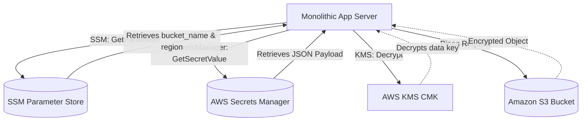

# FanVault v2 — Monolithic Security & Secrets Architecture

This document details the transition from an ALB-routed multi-server microservices setup to a secure monolithic architecture, explaining how secrets, parameters, and KMS-encrypted objects are managed in production.

---

## 1. Problem Statement

### Original Architecture (Microservices)
Originally, the FanVault application operated as a set of separate tiers:
- **Frontend tier** (served by Nginx on dedicated EC2 instances).
- **Backend services** (Identity Service and Commerce Service running on separate EC2 instances).
- **Consolidated Database** (MongoDB running on its own dedicated instance).
- **Routing**: An AWS Application Load Balancer (ALB) listened publicly and evaluated path-based routing rules, forwarding API traffic directly to the target groups of the backend services on their private ports (`:3001` and `:3002`).

While highly scalable, this created architectural overhead (multiple target groups, cross-service networking rules, and reliance on ALB listener rules for internal routing), resulting in complexity and increased AWS costs.

### Consolidating to Nginx-Routed Monolith
The goal was to convert this application to run **both the frontend and backend services on a single monolithic EC2 instance** while keeping the database hosted on a separate private instance. 

#### Challenges & Solutions:
1. **Routing Incompatibilities (Nginx Redirects)**: Standard Nginx location prefixes like `location /api/orders/` would redirect requests without trailing slashes (e.g. `POST /api/orders`), causing HTTP verb downgrades (from `POST` to `GET`) and authorization failures.
   * *Solution*: Configured exact prefix matching in Nginx by removing trailing slashes (`location /api/orders`).
2. **Nginx Priority Overrides (Regex matching)**: General regular expressions for static files (e.g. matching `.jpg` or `.png`) took precedence over API prefixes, causing local static asset lookups for S3 proxy routes and returning `404 Not Found`.
   * *Solution*: Applied the Nginx `^~` modifier (e.g. `location ^~ /api/products`) to force prefix matching and bypass regular expression rules entirely for APIs.
3. **Decoupled Database**: Kept the database instance isolated, while providing automated bootstrapping/seeding via the App Server.

---

## 2. Secrets & Parameters Management

To enforce security best practices (avoiding hardcoded passwords, AWS keys, or configuration parameters in source control or configuration files), the monolithic server utilizes AWS Systems Manager (SSM) Parameter Store and AWS Secrets Manager.



### AWS Secrets Manager
Used for **highly sensitive, dynamic credentials** (e.g., MongoDB credentials, database hosts, JWT tokens).
- **Dynamic Retrieval**: Mongoose connection helper `db.js` retrieves the secret JSON payload `production/mongodb` on startup via the `@aws-sdk/client-secrets-manager` library.
- **Dynamic URI construction**: The connection URI is built dynamically at runtime:
  `mongodb://<username>:<password>@<host>:<port>/<database>?authSource=<authSource>`
- **JWT Injection**: Token signing secrets (`jwtSecret` and `jwtRefreshSecret`) are injected dynamically from the secret payload straight into the server's environment variables (`process.env`), preventing any cleartext disk persistence.
- **Local Fallback**: During local development, the code automatically falls back to local `.env` variables if Secrets Manager is not enabled (`USE_SECRETS_MANAGER=false`), enabling seamless developer onboarding.

### AWS Systems Manager (SSM) Parameter Store
Used for **non-sensitive, structural configuration parameters** (e.g., S3 bucket names, regions).
- **Decoupled Configuration**: Rather than hardcoding S3 configuration or storing it in `.env` files, parameters `/fanvault/s3/bucket` and `/fanvault/s3/region` are queried dynamically using `@aws-sdk/client-ssm`.
- **Memory Caching**: To prevent hitting AWS rate limits and adding API latency to every image request, the parameters are fetched once and cached in memory inside the Node process.

---

## 3. S3 Objects & AWS KMS Customer Managed Keys (CMK)

For enterprise-grade security, static product images are stored in a private S3 bucket and encrypted with **Server-Side Encryption using AWS KMS Customer Managed Keys (SSE-KMS)**.

### S3 Image Proxying
To hide S3 bucket details from the client browser, the App Server proxies image retrieval through the endpoint:
`GET /api/products/images/:key`

1. The client requests the image path.
2. The Commerce Service fetches the S3 configuration from SSM.
3. The service calls S3 `GetObjectCommand` via `@aws-sdk/client-s3`.
4. The backend streams the image bytes directly to the browser, returning the correct MIME type and caching headers.

### KMS CMK Encryption Integration
When S3 objects are encrypted with a Customer Managed Key (CMK), standard S3 permissions (`s3:GetObject`) are **insufficient** to read the file. The requesting identity must also possess decrypt permissions for the specific KMS key.

#### How Decryption Works at Runtime:
1. When the app calls `s3.send(new GetObjectCommand(...))`, S3 requests AWS KMS to decrypt the object's encrypted envelope data key.
2. AWS KMS verifies if the App EC2 instance's IAM Role has permissions to use the KMS CMK.
3. If allowed, KMS decrypts the envelope key and sends it to S3, which decrypts the object and streams the plaintext bytes back to the App Server.

#### Required IAM Policy:
To authorize this workflow, the EC2 instance profile must have the following combined policy:

```json
{
  "Version": "2012-10-17",
  "Statement": [
    {
      "Sid": "AllowParameterStoreAccess",
      "Effect": "Allow",
      "Action": [
        "ssm:GetParameter",
        "ssm:GetParameters"
      ],
      "Resource": "arn:aws:ssm:us-east-1:ACCOUNT_ID:parameter/fanvault/s3/*"
    },
    {
      "Sid": "AllowS3ReadAccess",
      "Effect": "Allow",
      "Action": [
        "s3:GetObject"
      ],
      "Resource": "arn:aws:s3:::YOUR_S3_BUCKET_NAME/*"
    },
    {
      "Sid": "AllowKMSDecryptAccess",
      "Effect": "Allow",
      "Action": [
        "kms:Decrypt",
        "kms:DescribeKey"
      ],
      "Resource": "arn:aws:kms:us-east-1:ACCOUNT_ID:key/YOUR_KMS_KEY_ID"
    }
  ]
}
```

---

## Summary of Security posture
By migrating to this design:
- **No Secrets on Disk**: Hardcoded configurations have been eliminated from the files on the App server.
- **Least-Privilege Networking**: Local Node.js services run on `127.0.0.1` and are protected from external internet scanning.
- **Fine-Grained Auditing**: AWS CloudTrail audits every attempt to access SSM parameters, pull secrets, or decrypt images using the KMS key.

---


---


---


---


---


---


---
